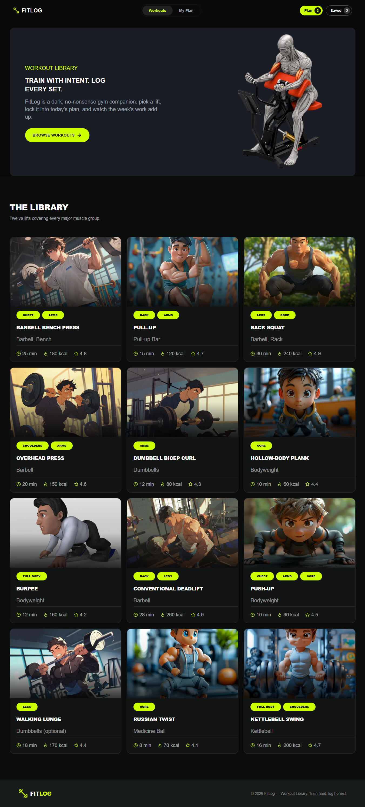

# 🏋️ FitLog - Workout Library

FitLog is a modern and responsive workout library web application built with Next.js and Typescript. It allows users to explore different workouts, view detailed exercise information, build a personal workout plan, save favorite workouts, and track completed expercises.

## 🌐 Live Demo

🔗 [Live Site](#)

## 📂 GitHub Repository

🔗 [GitHub Repository](https://github.com/your-username/your-repository)

## 📸 Project Preview

<!-- Add your project screenshot here -->



## 🚀 Technologies Used

-**Next.js** -- React framework with App Router -**React** -- Component-based UI development
_**Typescript** -- Type-safe development -**TailwindCSS** -- Responsive and modern UI styling -**Context API** -- Global workout plan and saved-workout state management -**React Toastify** -- User-friendly toast notifications
_**Lucide React** -- Modern icons -**REST API** -- Workout data fetching -**LocalStorage** -- Persisting plan and saved workout data

## ✨Key Features

### 1. 📚 Workout Library

Browse a collection of workouts with important information such as:

- Workout name
- Muscle groups
- Difficulty
- Equipment
- Duration
- Calories
- Rating

## 2. 🔎 Search & Sort Workouts

Quickly find workouts using the search functionality and sort exercises by:

-Duration
-Calories
-Rating

### 3. 📝 Personal Workout Plan

Add workouts to your personal plan and manage them easily. The plan supports a maximum of **5 workouts** at a time and provides live statistics for:

- Total exercises
- Total workout minutes
- Total calories

### 4. ❤️ Save & Track workouts

Save your favorite workouts for later and mark workouts as completed after finishing them. Toast notifications provide immediate feedback for user actions.

### 5. 💾 LocalStorage Persistence

Your workout plan, saved workouts, and completed workout status are stored in the browsers's `localStorage`, so your data remains available even after refreshing the page.

## 📱 Resposive Design

Fitlog is fully responsive and optimized for:

- 📱 Mobile
- 📲 Tablet
- 💻 Desktop

## 🔗 API

FitLog uses a REST API to load workout information.

**All Workouts: **

````text
https://api.api-store.workers.dev/api/fitlog


<!-- This is a [Next.js](https://nextjs.org) project bootstrapped with [`create-next-app`](https://nextjs.org/docs/app/api-reference/cli/create-next-app).

## Getting Started

First, run the development server:

```bash
npm run dev
# or
yarn dev
# or
pnpm dev
# or
bun dev
````

Open [http://localhost:3000](http://localhost:3000) with your browser to see the result.

You can start editing the page by modifying `app/page.tsx`. The page auto-updates as you edit the file.

This project uses [`next/font`](https://nextjs.org/docs/app/building-your-application/optimizing/fonts) to automatically optimize and load [Geist](https://vercel.com/font), a new font family for Vercel.

## Learn More

To learn more about Next.js, take a look at the following resources:

- [Next.js Documentation](https://nextjs.org/docs) - learn about Next.js features and API.
- [Learn Next.js](https://nextjs.org/learn) - an interactive Next.js tutorial.

You can check out [the Next.js GitHub repository](https://github.com/vercel/next.js) - your feedback and contributions are welcome!

## Deploy on Vercel

The easiest way to deploy your Next.js app is to use the [Vercel Platform](https://vercel.com/new?utm_medium=default-template&filter=next.js&utm_source=create-next-app&utm_campaign=create-next-app-readme) from the creators of Next.js.

Check out our [Next.js deployment documentation](https://nextjs.org/docs/app/building-your-application/deploying) for more details. -->
